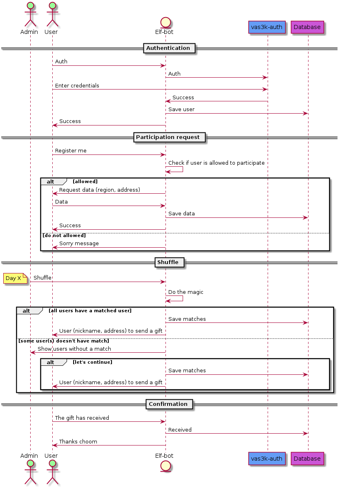

# vas3k-santa

## Description
Telegram bot - elf, to help Santa

## Basic sequence diagram

## Development
### How to run
List of required properties:

- `app.bot.token` (`APP_BOT_TOKEN`) - bot token, you get it when you register your bot on Telegram
- `app.bot.username` (`APP_BOT_USERNAME`) - bot username, you get it when you register your bot on Telegram
- `spring.security.oauth2.client.registration.vas3k-reg.client-id` (`SPRING_SECURITY_OAUTH2_CLIENT_REGISTRATION_VAS3K-REG_CLIENT-ID`) -  OAuth Client ID, you get it when you register your application on [vas3k.apps](https://vas3k.club/apps/)
- `spring.security.oauth2.client.registration.vas3k-reg.client-secret` (`SPRING_SECURITY_OAUTH2_CLIENT_REGISTRATION_VAS3K-REG_CLIENT-SECRET`) - OAuth Client Secret, you get it when you register your application on [vas3k.apps](https://vas3k.club/apps/)
- `spring.datasource.username` (`SPRING_DATASOURCE_USERNAME`) - Username for the database
- `spring.datasource.password` (`SPRING_DATASOURCE_PASSWORD`) - Password for the database
- `spring.datasource.url` (`SPRING_DATASOURCE_URL`) - URL for the database, e.g.: `jdbc:postgresql://172.19.0.2:5432/santa?createDatabaseIfNotExist=true`

You can specify them in the additional configuration file and locate them via application parameter `spring.config.additional-location` 
or via environment variables. See the Spring boot [documentation](https://docs.spring.io/spring-boot/docs/current/reference/htmlsingle/#features.external-config).
